# HTML-CSS-Website
# DECO1016 Final Assignment: Website Prototype

A destination website for Shirakawa-go, Japan. 

## Table of Contents

- [Introduction](#introduction)
- [Justifications for Implementation Decisions](#justifications-for-implemention-decisions)
- [Design Patterns and Principles](#design)
- [Comparisons between Mockups and Prototypes](#comparisons)
- [Refinements and Iterations](#refinements-and-iterations)
- [Acknowledgements and References](#acknowledgements-and-references)
- [Author](#author)

## Introduction and Overview

The purpose of this website is to broaden awareness of Shirakawa-go - their history, architecture, food and otherwise, informing travellers with a holistic understanding of the culture before visiting. 

## Justification for Implementation Decisions

### Design Patterns and Principles

* Typography and Design

As opposed to the text and element heavy of Web 1.0 and early Web 2.0 websites, to make the website attractive to current users I distilled elements according to minimalism. Contemporary technology users usually are characterised by their love for the simplistic aesthetic and deterred from designs that possess too many elements on the page (Hauser et.al, 2023).

The below image demonstrates hierarchy between elements through typography. Larger text, or text that is higher than another, improves overall readibilty - allowing information to be easier to comprehend and allows readers to differentiate between sections (Yadav, 2014).

I chose to use rounded shapes and minimalistic designs and fonts as minimalistic designs are aesthetically pleasing and less distracting. Also, rounded shapes are “psychologically associated with a sense of safety” and therefore are easier to comprehend (Logic Design, n.d.).
Circles and red in the design are symbolic of the Japanese flag. It is a common trope of Japanese culture and using these design elements is consistent with Nielson's (1999) principle of "consistency" where similar elements across all designs have similar meanings. 
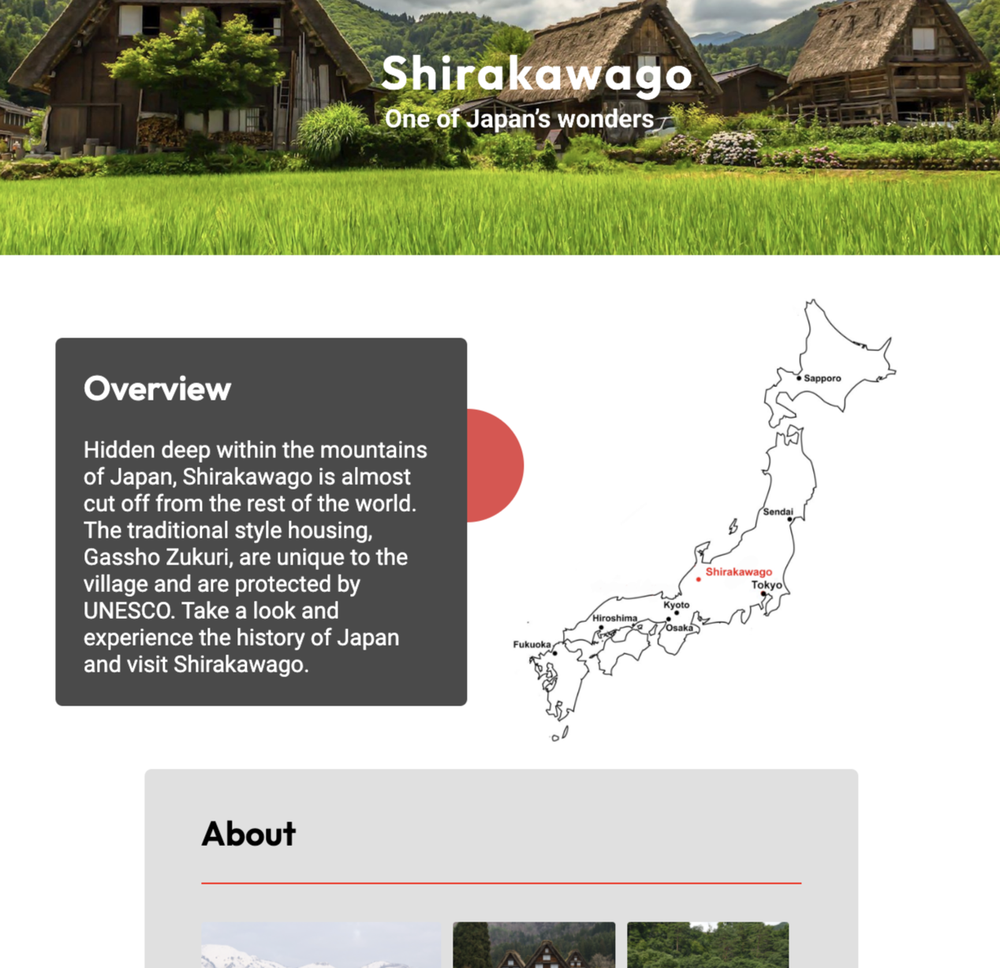

* Affordances

The image below demonstrates the before and after images of the "nav" bar. The before image is for desktops and the larger space around elements allows visibility whereby "the more visible an element is, the more likely users will know about them and how to use them" (Norman, 1988).
However, in the mobile version, there is less visibilty and makes the "mav" bar less noticable to interact with. As such, I recreated the "nav" bar to resemble buttons and make them more "affordable" and inviting to interact with (Norman, 1988).
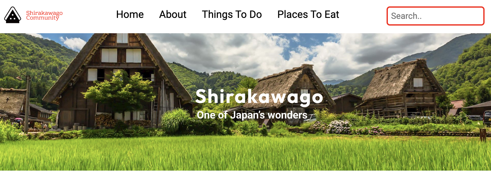
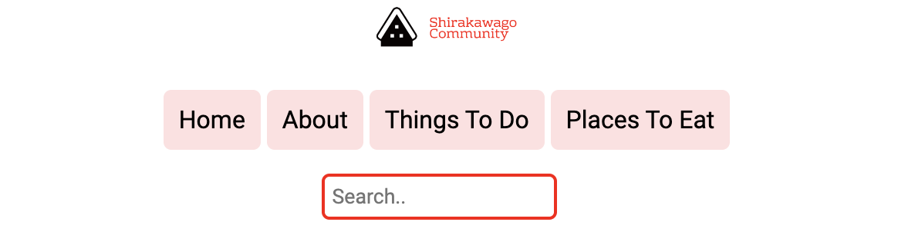

This is applied simlarly to the contents on the "about" and "things to do" pages. Content sectioning and categorisation throughout the website helps users to understand presented content faster and easily (UI Patterns, n.d.) and improves overall navigation and usability.
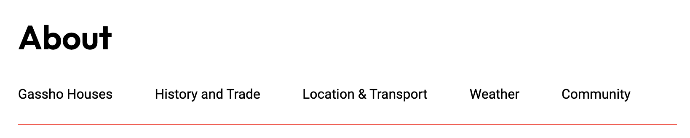
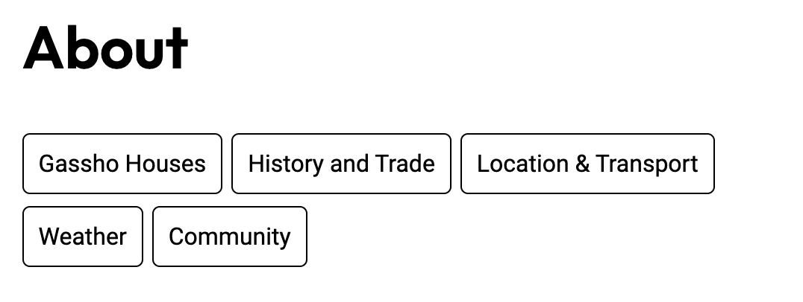

Another affordance is the hover state of the mouse over specific elements. When hovering over links that go to different pages or external links, the text turns red and affords users to interact and click on those links. 
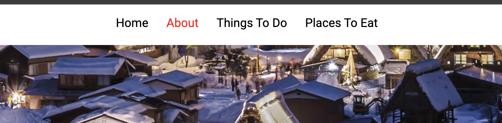
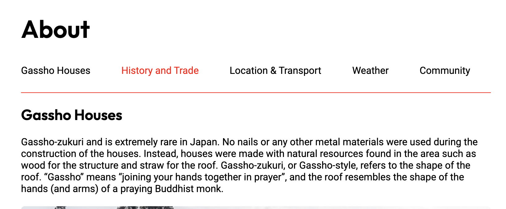
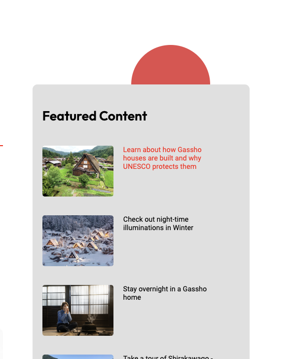

Another hover affordance is of the images on the home page. When the mouse is hovered over an image, a slight transformation occurs and enlarges the image. This is shown on community in the image below
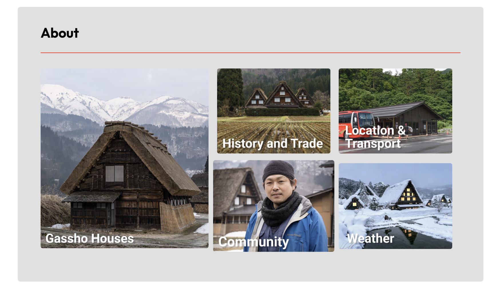

* Images
  
A heavy emphasis was deliberately placed on visually captivating images as they are more attention grabbing than walls of text and more likely to retain user attention. Lots of images also allow users to vicariously transport themselves to the destination and help them to make the decision on whether they are attracted, or want to travel to the featured location (Wixblog, 2022).

In these image carousels, some inspirational phrases are used tackle with present bias, for example: “Live a Japanese fantasy” and “capture beautiful memories”. These messages also encourage users to “future lock-in” by appealing to emotion, making them consider long term positive impacts of travelling to Shirakawago (UI Patterns, n.d.).

* Cards

Grey cards are used to separate content and to group similar elements under their respective subheadings. By visually grouping these elements it “reduces the cognitive load” on users as they can clearly identity different sections and can process information more easily (Graham, 2008 cited from Imtiaz, 2016)
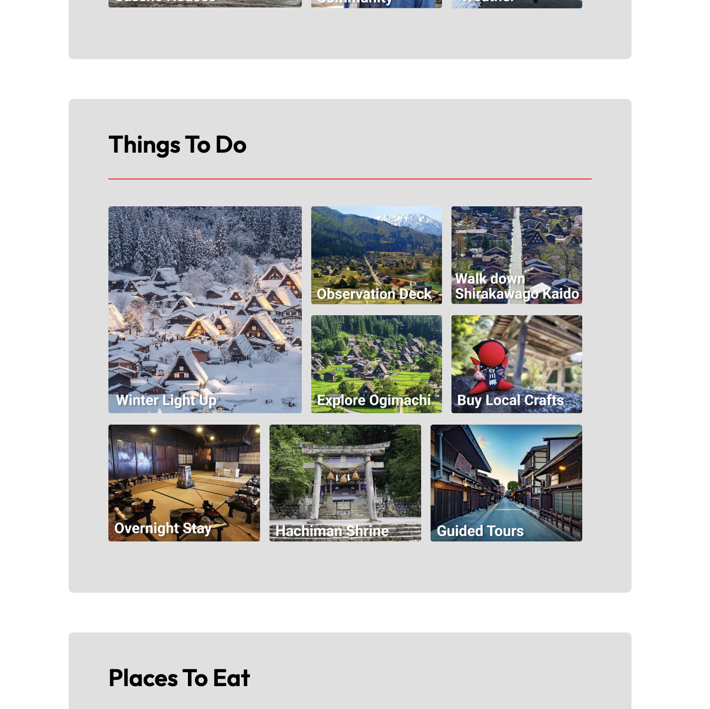

* Asides and Featured Content:
  
“Featured content” is displayed on side of most pages and is made to be “sticky” on the webpage. This evokes curiosity in users as the content persists as they scroll and encourages them to navigate into other pages of the website. This is because “as humans, we are driven to seek more information to close the knowledge gap” (UI Patterns, n.d.).
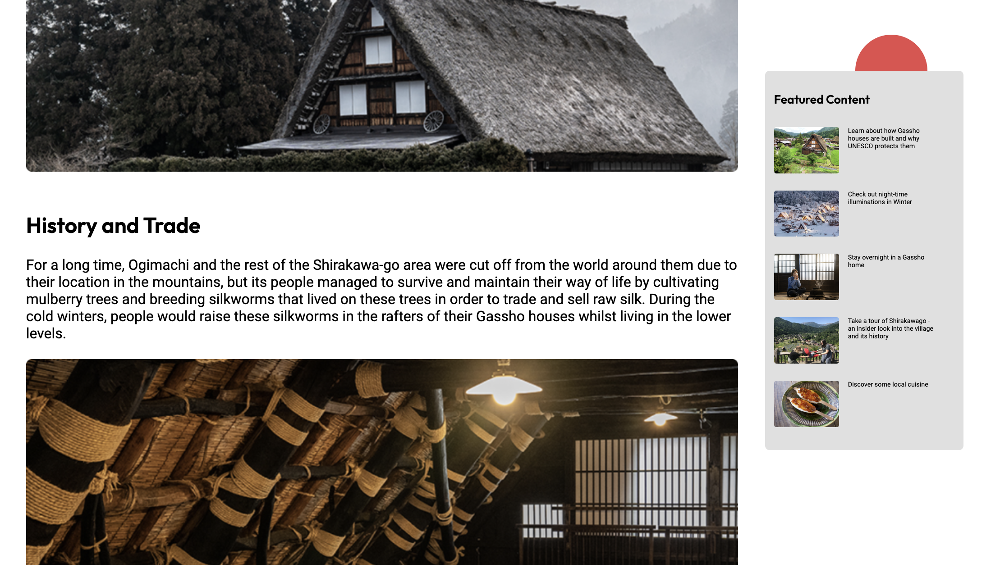

* Limited Choice

In the "Places to Eat" page, by focusing on only 3 main restaurants, we make information less complex and easier for users to digest. This uses the technique of limited choice which says that individuals are more likely to make a decision if they are faced with limited options (UI Patterns, n.d.).
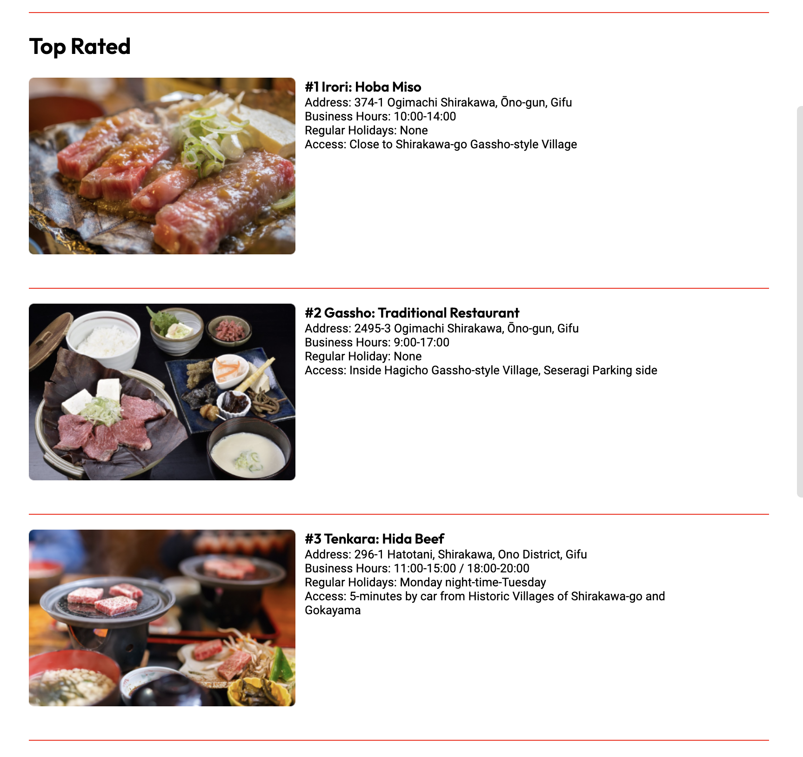

### Accessibility 

* Using Alt Attributes

Alt text enables screen readers to read the information about on-page images for the benefit of a person with complete lack of sight, visually impaired, or who is otherwise unable to view the images on the page.

* Colour and Contrast

These are the main text colours and their respective background colours. Here, they have been put through a colour contrast tester and the results show that there is a large contrast and therefore makes the text and design more accessible to visually colour impaired individuals

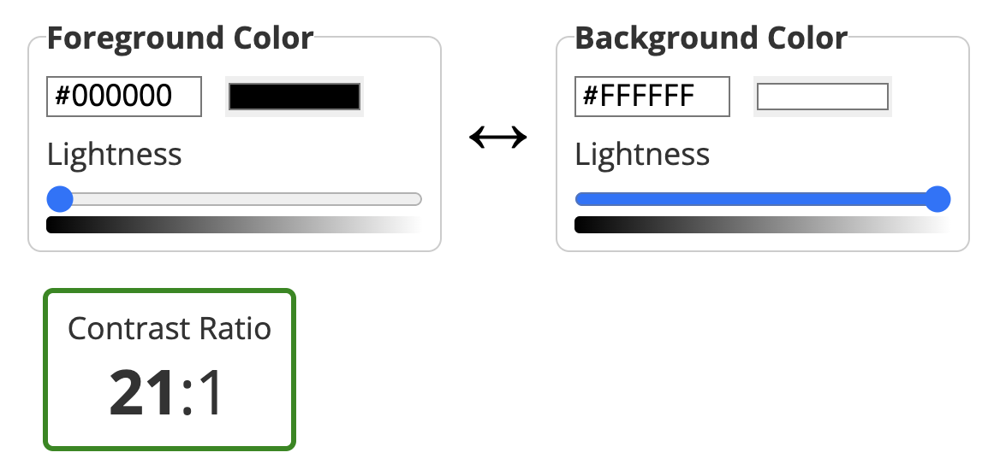
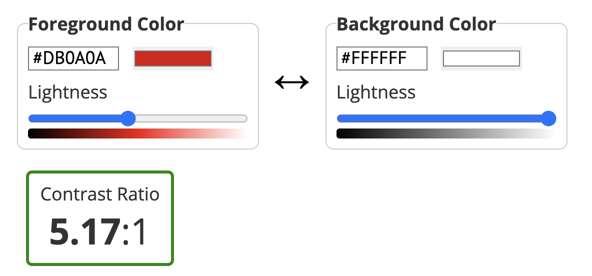
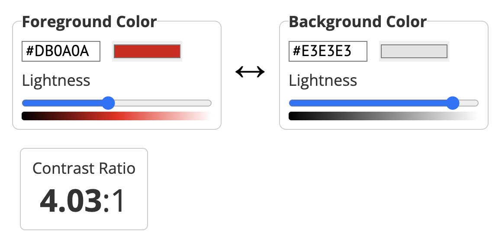
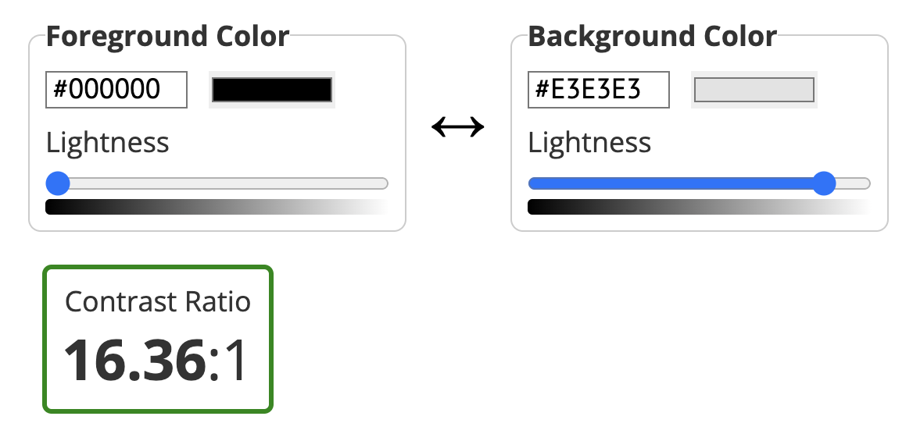

* Using Live Server, Dev Tools and Testing

Through these developer tests, it was possible to assess the responsiveness of my website design. As seen, the design responds well to the smallest device, IPhone SE, and Ipad as well. 
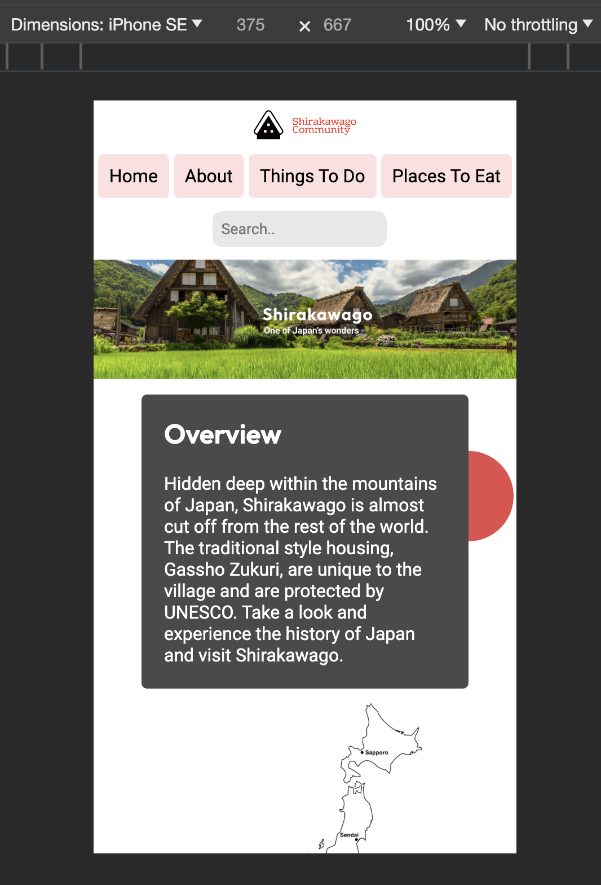
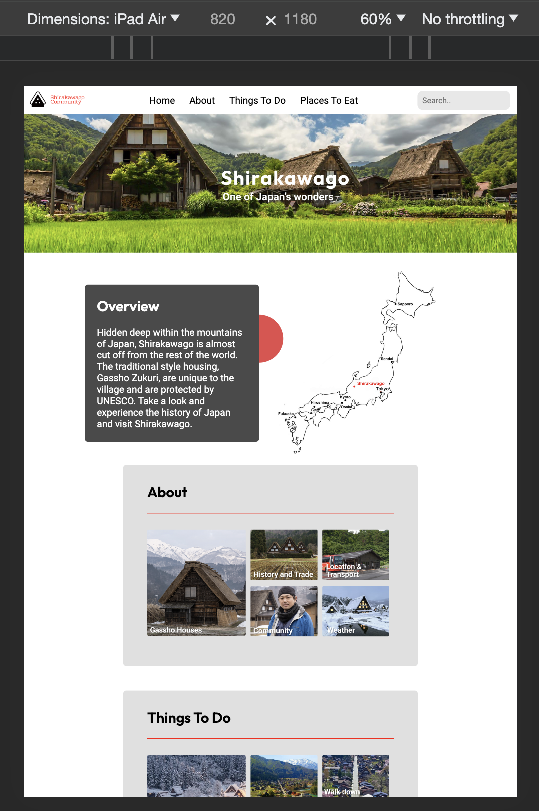

The tested and usable browser are Chrome and Safari.

## Comparisons between Mockups and Prototypes

While the assignment specification states that the website is not expected to be fully functional and JS is not included as course content for this course some mockup features had to be adjusted because they would rely on implementation with JS.

For example, in my mockup on the phone version, the aside collapses and becomes hidden in the right side bar, but in my prototype, users would need to swipe or click the red circle in order for it to re-appear. I am unable to achieve this without Javascript.
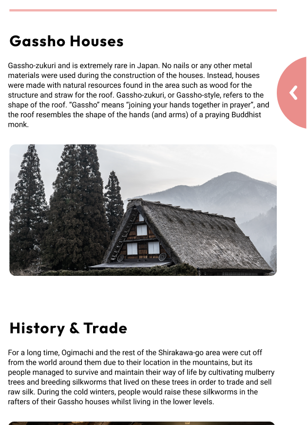
Also, the carousel in the header of the website was out of the scope of what we were learning to recreate (i.e. more Javascript). 

Another struggle that I had was with the navigation bar, it was confusing to put multiple containers in each other whilst also accounting for media queries. I would have put the "nav" and "search bar" in one container and used "justify content" to "flex end" which would look more like the mockup. However, this made making media queries a bit more confusing where I wanted them to all vertically align with the inital logo. 

Another aspect was the animated "nav" bar. Making a "nav" with a thick underline and grouping it within the container under the correct word was a bit confusing and difficult. Not only that, but my initial idea was for it to animate along with clicking each "nav" element but this was not possible without Javascript. 

## Refinements and Iterations

On the "Places to Eat" page, I removed the lines separating cards. From usability testing, a comment was made saying that the lines "should be used to separate sections" and "should be used sparingly". The abundance of lines between sections disrupted the flow of information and also went against the minimalistic aesthetic that I was aiming for.

Before:

After:
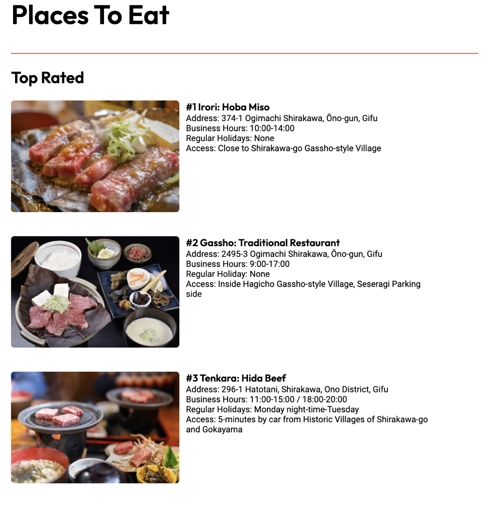

Another refinement that I did was refactor with responsive code like "display: flex". Initally, I used "display: absolute" or "display: relative" to postion my items. However, I realised that this was extremely difficult to adapt to media queries.

Another iteration that I made was separating my page into 3 sections: "header", "main" and "footer". In my first attempt, I made multiple sections in my "layoutit!" template to account for each element in my page, for example, one for the logo, one for the nav bar, one for the search bar and so on. By separating the page into 3 sections and using "display: flex" instead, it made positioning items much easier.P 

One of the design iterations that was already mentioned but a prominent aspect of my design, is the afforances of buttons from the desktop to mobile screens. The mockups did not have this and it was only during coding and usability testing with a potential user, that I realised that maintaining what I had from the mockups did not afford users to interact with some elements that I had made. As such, the buttons the navigation abr and contents bar was made. 

Another iteration that I made was the aside bar. I decided that if it were to persist throughout the page from the beginning, it would look more realistic and look as though it was apart of its own section, separating it from the rest of the content as it is not associated with the title of that page.  
Before:
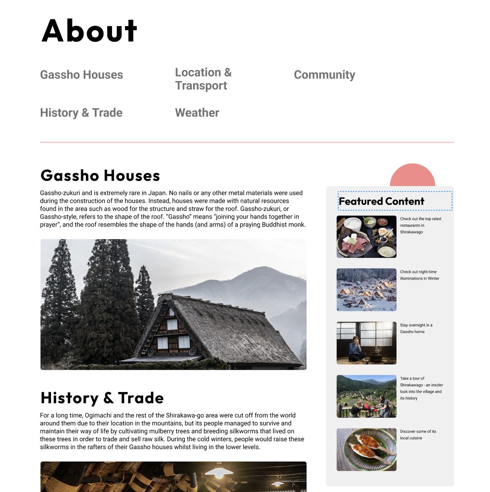
After:
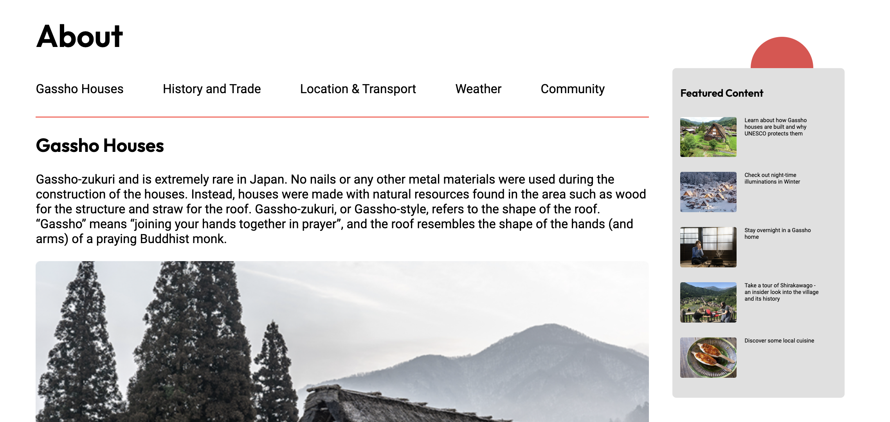

### Things that Didn't Work

When trying to add a-href links to my images, disrupted up my entire layout. What I attempted to do was have one larger, "main_image", and the "support_images" wrapped next it. "main_image" and "support_images" are separate divs both inside a bigger div: "section_container".

I thought that by changing my css to target "a" instead of "img", the layout would return to normal. However, it did not. I have also tried re-working my css to work around the problem - changing widths and heights, but the design . I even tried putting my entire "main_image" in its own div. Although, through examining the code, adding href's should not have affected the CSS. I believe there is a hidden error that I am unable to locate.

I even asked on stack overflow forum for a potential answer but was unsuccessful in achieving a solution. 
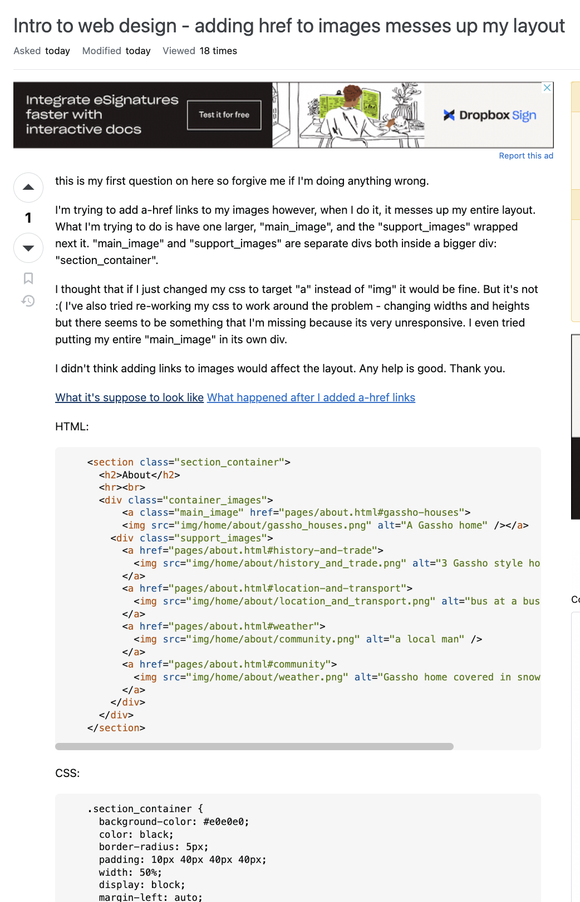

In the end, I was unable to get the links in the images to work in the index.html. They are interactive and zoom when hovered, however, they don't link to the pages and sections that I intended for them to do so. The failed code is linked in the index.html.
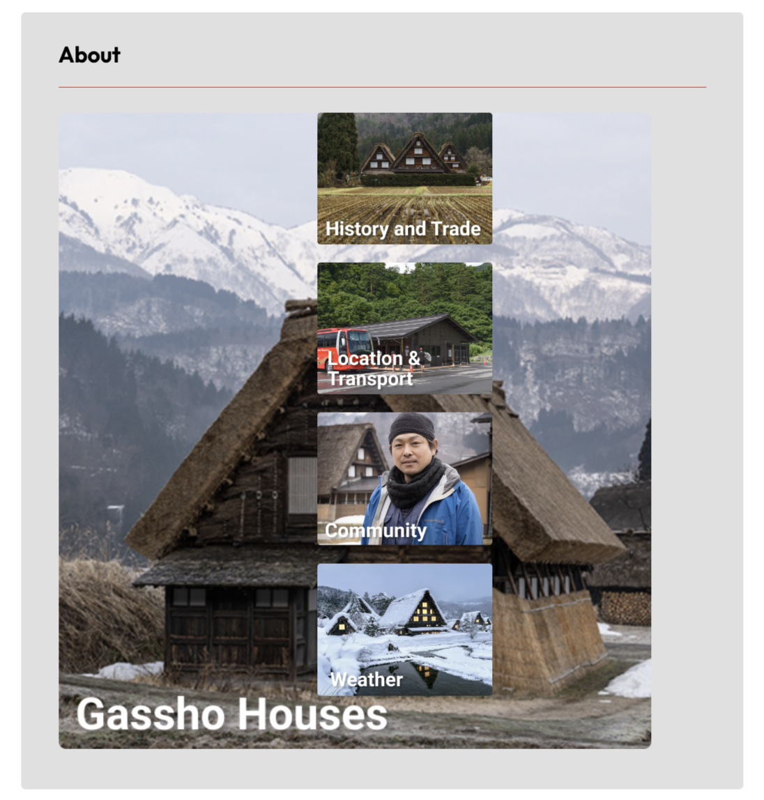

## Acknowledgements and References

CONTENT:
Hauser, S. Redström, J. & Wiltse, H. (2023). The Widening rift between aesthetics and ethics in the design of computational things. In K.S. Gill (Eds.) _AI & Society: Journal of Knowledge, Culture and Communication, 38_, 227–243. https://doi.org/10.1007/s00146-021-01279-w

Imtiaz, S. (2016). _The Psychology Behind Web Design_. McMaster University. doi: 10.13140/RG.2.2.17394.56001

Logic Design. (n.d.). _Why do we have Rounded Corners in Website Design?_. https://www.logicdesign.co.uk/blog/why-do-we-have-rounded-corners-website-design/#:~:text=Easier%20for%20the%20Brain%20to%20Compute,-In%20addition%20to&text=The%20natural%20movement%20of%20our,computation%20when%20viewing%20them%20too.

Nielson, J. (1999). _Nielson’s 10 Usability Heuristics_. https://www.heurio.co/nielsens-10-usability-heuristics

Norman, D. (1988). _What are Norman’s Design Principles?_. https://www.educative.io/answers/what-are-normans-design-principles

UI Patterns. (n.d.). _User Interface Design Patterns_. https://ui-patterns.com/

Wixblog. (2022). _14 Best Travel and Tourism Websites to Inspire Your Own_. https://www.wix.com/blog/travel-and-tourism-websites?psafe_param=1&utm_source=google&utm_medium=cpc&utm_campaign=13774768254^126077909642&experiment_id=^^531699814043^^_DSA&gclid=Cj0KCQjwmvSoBhDOARIsAK6aV7iivaWfBLq-gyuAGgDHeiu0iCD2SbjRzuSyJc9tDb-FV9Q2LrXAxf0aAia9EALw_wcB

Yadav, P. (2014). Typography as a statement of Design. _Conference: HWWE 14At: IIT GUWAHATI_. https://www.researchgate.net/publication/316683307_Typography_as_a_statement_of_Design

IMAGES:
Alpico Group. (n.d.). _A Must-Visit World Heritage Site! The Historical Village of Shirakawa-go_. https://www.alpico.co.jp/en/travelog/post/unesco-world-heritage-shirakawa-go/

Audley. (n.d.). _Visit Shirakawago, Japan_. https://www.audleytravel.com/us/japan/places-to-go/shirakawago

Centrip Japan. (2019). _Shirakawa-go’s Must-Eat Gourmet: Centrip Japan’s Complete Guide to Shirakawa-go_. https://centrip- japan.com/article/946.html

Flickr. (2015). _Shirakawa-go Three Houses – Wide_. https://www.flickr.com/photos/7272097@N08/24244510299/in/photostream/

Fun! Japan. (2019). _You Definitely Want to go Here! 3 Recommended Restaurants of Shirakawa-go in Japan_. https://www.fun- japan.jp/en/articles/9946

I Wander. (2017). _Guide to visiting Shirakawa-go (How to get there, Travel guide with printable map, where to eat)_. https://iwandered.net/shirakawa-go-travel-guide/

Japan. Endless Discovery. (2022). _Shirakawa-go in Winter_. https://www.japan.travel/en/ca/news/shirakawa-go-in-winter/

Samurai Tours. (n.d.). _Shirakawago_. https://www.samuraitours.com/destinations/shirakawago/

Shirakawa-go Tourist Association. (n.d.). _Irori Restaurant_. https://shirakawa-go.gr.jp/en/shop/16/

Snow Monkey Resorts. (2023). _15 Things to do in Shirakawa-go & Where to Stay_. https://www.snowmonkeyresorts.com/smr/takayama-city/things-to-do-in-shirakawa-go-where-to-stay/

Visit Gifu. (n.d.). _Shirakawa-go: A lesson on true human connection and ideology referred as Yui_. https://visitgifu.com/specials-of-gifu/shirakawa-go/

## Author

Created by Jason Eng 

Student Number: 530575467

Unikey: JENG8615
